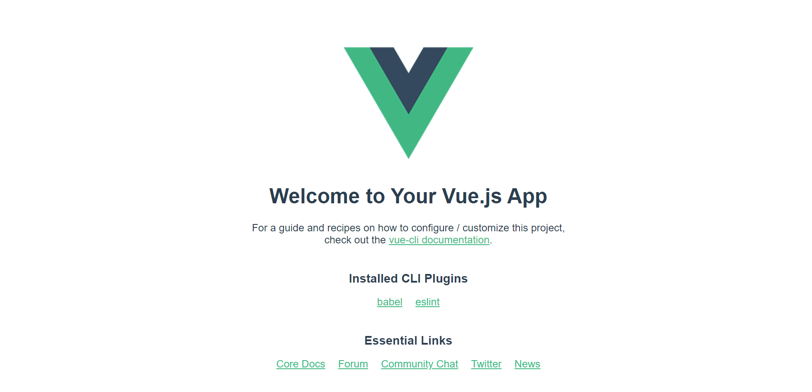
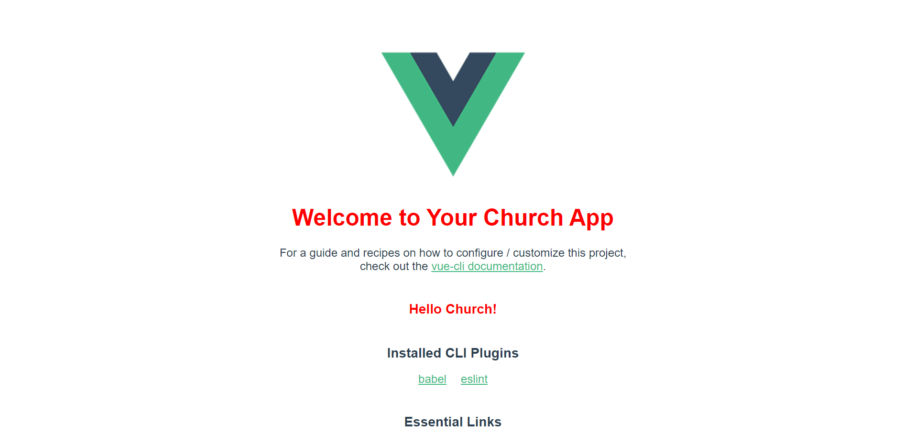

# README

## 📌 Target

- Vue Project를 생성한다.
- Vue Project 구조를 이해한다.

## 📌 Step

### 1. Vue 설치하기

1. Node Package Manager를 설치한다.
2. Node Package Manager로 `vue-cli`를 설치한다.

### 2. Vue 프로젝트 생성하기

1. `hello-church`라는 이름의 vue project를 생성한다.

### 3. 프로젝트 서버 실행하기

1. 프로젝트 폴더로 이동한다.

2. Vue 프로젝트의 서버를 실행한다.

   프로젝트를 실행하고 localhost의 포트로 접속하면 아래와 같은 화면이 표시되는 것을 확인할 수 있다.

   

### 4. 프로젝트 구조 파악하기

1. 아래 자료를 참고하여 Vue 프로젝트의 폴더 구조를 이해합니다.
   - https://m.blog.naver.com/phongdaegi/221976297043
   - https://github.com/SongArtish/TIL/blob/master/Vue.js/02_SFC.md

### 5. 메시지 변경하기

1. 아래 이미지와 같이 화면의 메시지를 변경해보세요. (빨간색 부분)

   한 부분은 수정해야 하고, 한 부분은 추가해야 합니다. 각 메시지가 어디에 위치해있으며, 어디서 상속을 받는지 확인해보세요.

## 참고자료

- [Creating a Project](https://cli.vuejs.org/guide/creating-a-project.html)
- [[Vue.js] Vue.js 설치 및 실행, 접속 방법](https://kkamikoon.tistory.com/entry/Vuejs-Vuejs-%EC%84%A4%EC%B9%98-%EB%B0%8F-%EC%8B%A4%ED%96%89-%EC%A0%91%EC%86%8D-%EB%B0%A9%EB%B2%95)