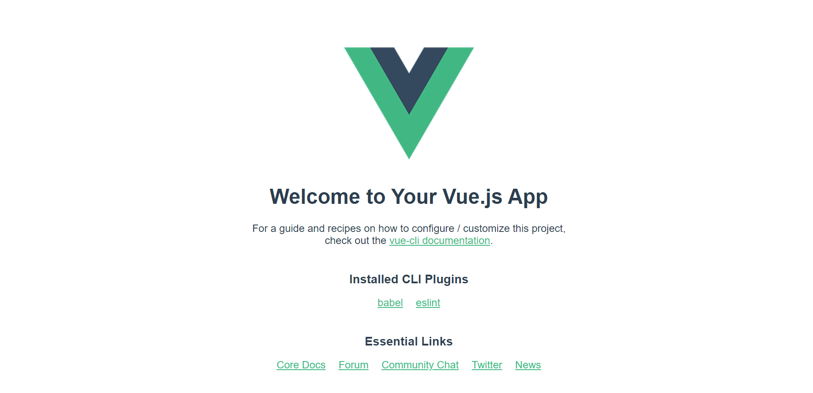

# README


## 📌 Target

- `node_modules` 설치하기
- 컴포넌트 상속 이해하기


## 📌 Step

### 1. 프로젝트 생성하기

1. `vue-words-button` 프로젝트에 들어가 node 패키지를 설치해준다.
   ```bash
   npm install
   ```

2. 서버를 실행하여 화면이 잘 표시되는지 확인한다.

   

### 2. 다른 컴포넌트 가져오기

1. `App.vue`에서 `HelloWorld.vue` 대신 `TodayWords.vue` 컴포넌트를 표시해주도록 코드를 수정한다.
2. 말씀 리스트(`words` 변수)에 말씀 구절을 몇 개 입력합니다.
3. 버튼을 눌러서 랜덤 말씀이 표시되는지 확인합니다.

4. `TodayWords.vue`의 코드 내용을 숙지합니다.

### 3. 심화

위에서 학습한 내용을 바탕으로 `vue-words-button2` 프로젝트에서 `TodayWords.vue` 코드를 직접 작성해봅니다.