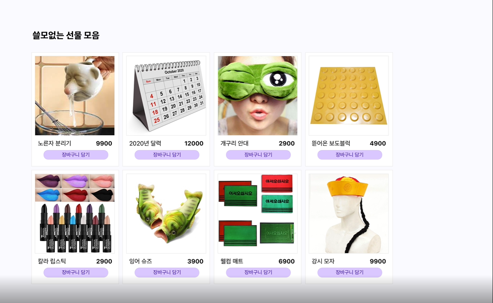

# README

## Overview

쇼핑 리스트를 담을 수 있는 쇼핑 카트를 구현한다.

## 폴더 구조
```
...
src
ㄴ components
    ㄴ CartItem
    ㄴ ListItem
    ㄴ NavBar
    ㄴ OrderSummary
ㄴ pages
    ㄴ ItemList
    ㄴ ShoppingCart
...
```

## 페이지 구성

1. 상품리스트(`ItemList`)
    - 임의의 상품 리스트가 카드 형태로 표시된다.
    - 리스트의 각 상품은 `ListItem` 컴포넌트를 자식 컴포넌트로 가진다.



2. 장바구니(`ShoppingCart`)
    - 장바구니 담기를 한 상품이 카드 형태로 표시된다.
    - 장바구니의 각 상품은 `CartItem` 컴포넌트를 자식 컴포넌트로 가진다.
    - 우측에는 `Order Summary`라는 자식 컴포넌트가 표시된다.


## 컴포넌트 구성

1. 쇼핑카트 아이템(`CartItem`)
    - 각 상품에는 상품 이미지, 상품명, 가격 정보, 선택 수량이 표시된다.
    - 각 상품에는 `삭제` 버튼이 있으며, 이 버튼을 누르면 해당 상품이 장바구니에서 모두 삭제된다.
2. 상품 리스트 아이템(`ListItme`)
    - 각 상품에는 상품 이미지, 상품명, 가격 정보가 표시된다.
    - 각 상품에는 `장바구니 담기` 버튼이 있으며, 이 버튼을 누르면 해당 상품이 장바구니에 추가된다.
3. 상단바(`NavBar`)
    - 페이지 상단에 공통적으로 표시되는 Navigation bar이다.
    - 상단바에서는 `ItemList`나 `ShoppingCart`로 페이지를 이동할 수 있는 버튼이 표시된다.
4. 주문 합계(`Order Summary`)
    - 주문 합계에는 총 아이템 개수, 합계 금액이 표시된다


## 요구사항

1. 상품 리스트에 표시될 아이템 더미 데이터 JSON 파일로 생성한다.
2. vue-router를 활용하여 페이지를 전환할 수 있다.
3. 상품 리스트에서 `장바구니 담기` 버튼을 누르면, 쇼핑카트에 상품 개수가 업데이트된다.